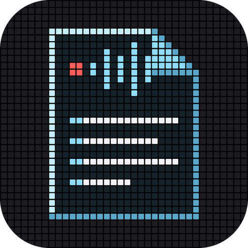

<h1 align="center">zmeet</h1>

Private meeting notes, recorded, transcribed and summarised entirely on your Mac.

  <a href="https://homebirdlabs.com/zmeet/download"><b>Download zmeet for Mac</b></a>
   Free · macOS 14 or later · Apple Silicon · signed and notarized by Apple

---

Press New meeting and zmeet is recording. Name it, choose online or in person, and add who's
there while it runs. The transcript appears live, and when the meeting ends zmeet writes the
notes: a summary, the actions, and each topic with its points, above the full transcript.

Your meetings are saved on your Mac and never leave it; the audio itself is never saved. The
only time zmeet goes online is a one-time model download, and only if the models aren't
already on your Mac. If you use [zwisp](https://github.com/zjsolomon/zwisp) or zchat, zmeet uses
the same model files.

zmeet is a [Homebird](https://homebirdlabs.com) program: install it here, or install and update
it with Homebird.
